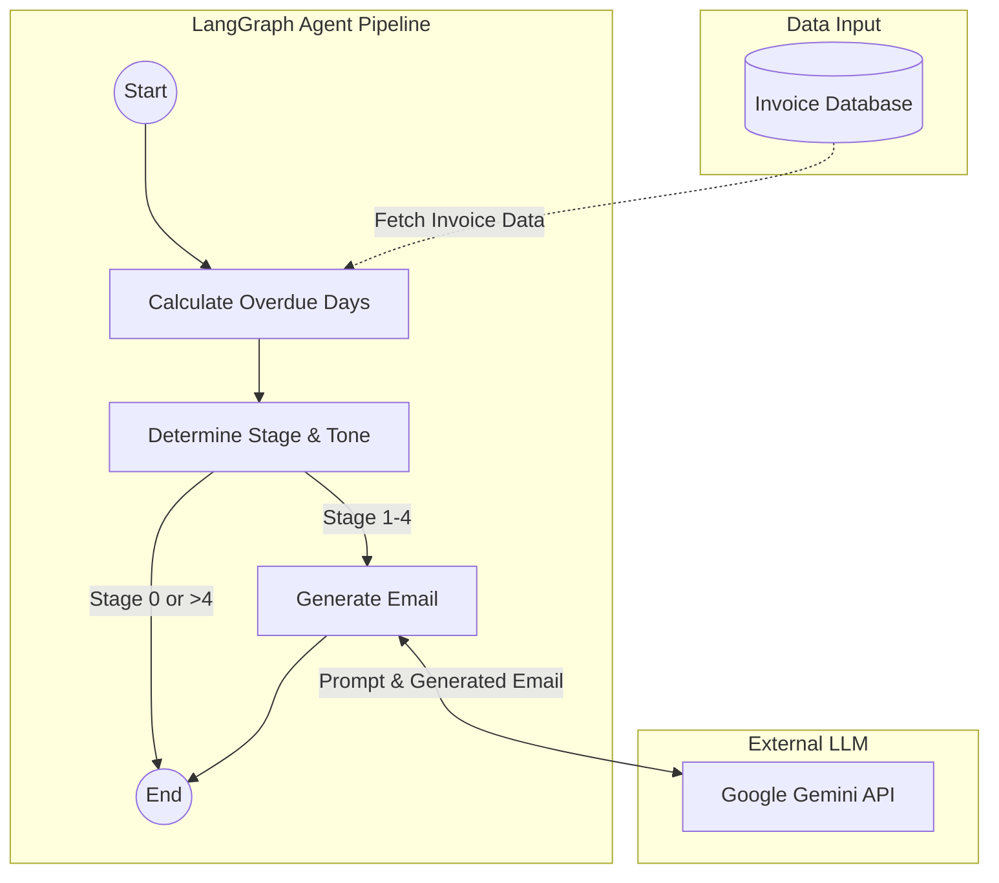

# AI Finance Collections Agent Platform

## Agent Pipeline Data Flow



## Overview
This project is an enterprise-ready AI Finance Collections Agent platform. It is designed to autonomously manage overdue invoices through an intelligent, LangGraph-orchestrated workflow. The system features dynamic risk scoring, automated and escalating email communications based on urgency, and a modern, premium SaaS dashboard for invoice management, human escalation queues, and live performance analytics.

## How I Approached the Project

### 1. Backend: Intelligent Agent & API
I built the backend using **FastAPI** to provide a robust and fast REST API. For the core intelligence, I implemented a stateful workflow using **LangGraph** and **LangChain**.
- **StateGraph Workflow:** The agent flow starts by calculating the overdue days for a given invoice.
- **Escalation Logic:** Based on the overdue days, the system determines the escalation stage (ranging from 1 to 5). The tone of the email dynamically adjusts—from a friendly reminder to a stern final warning.
- **LLM Integration:** I integrated `ChatGoogleGenerativeAI` configured for the **Gemini 2.5 Flash** model to dynamically generate personalized, context-aware emails that match the calculated tone.
- **Database & Auditing:** Used **SQLAlchemy** to manage the database, ensuring every action taken by the AI is recorded in an Audit Log. Invoices that exceed the maximum escalation stage (stage 5) are automatically pushed to an Escalation Queue for manual human review.

### 2. Frontend: Premium SaaS Dashboard
For the UI, I focused on creating a visually impressive, minimal, Apple-like interface to emulate an enterprise SaaS product.
- **Framework:** Built with the latest **Next.js 16** (App Router) and **React 19**.
- **Styling & UI:** Leveraged **Tailwind CSS v4** to build a clean, high-contrast, professional light theme using pure whites, deep charcoals, and classic iOS blues.
- **Live AI Email Viewer:** Integrated a real-time feed on the dashboard that pulls from the backend Audit Logs, allowing users to view the exact text of emails generated by the AI on the fly.
- **Data Visualization:** Integrated **Recharts** to display key performance analytics, allowing administrators to instantly grasp collection metrics.

### 3. Development Strategy
My strategy was to prioritize the core intelligent workflow and the dashboard's aesthetics:
- **Agent First:** I focused on getting the LangGraph pipeline right first, ensuring the "AI" aspect worked flawlessly and reliably.
- **Seamless UI:** Built the dashboard to immediately visualize the agent's actions (via the Live Email Viewer), demonstrating the platform's value instantly.
- **Modular Codebase:** Separated concerns strictly between the FastAPI backend and Next.js frontend, making debugging and rapid iteration much faster.

## Tech Stack
- **Backend:** Python, FastAPI, SQLAlchemy, LangGraph, LangChain, Google Gemini API
- **Frontend:** Next.js 16, React 19, Tailwind CSS 4, Recharts, Lucide Icons
- **Database:** SQLite (via SQLAlchemy ORM)

## Running the Application

### Backend
1. Navigate to the `backend` directory.
2. Install the necessary Python packages using your preferred virtual environment.
3. Set your `GEMINI_API_KEY` environment variable.
4. Run the FastAPI server:
   ```bash
   uvicorn app.main:app --reload
   ```

### Frontend
1. Navigate to the `frontend` directory.
2. Install dependencies:
   ```bash
   npm install
   ```
3. Start the development server:
   ```bash
   npm run dev
   ```

   ## Walkthrough Video

[Watch the Full Demo Walkthrough](https://drive.google.com/file/d/1sWwmu90UOeE-qUpWXUQqDJnrLqDgdLu2/view?usp=sharing)
